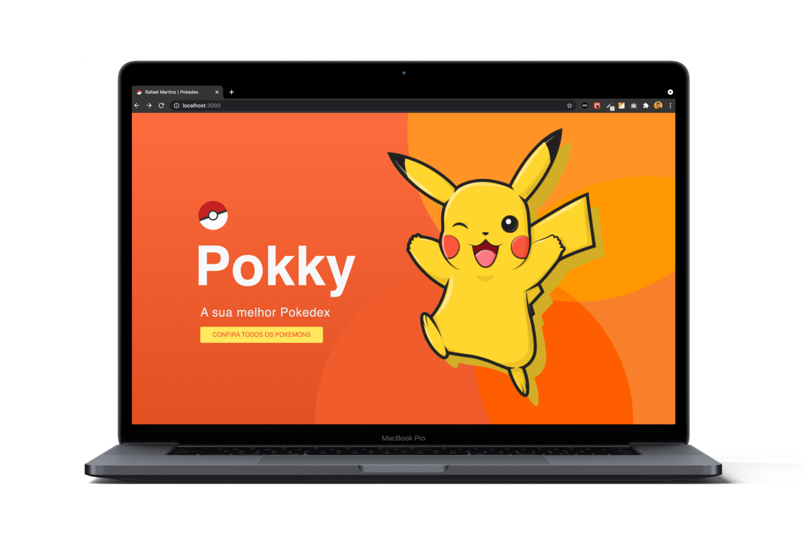
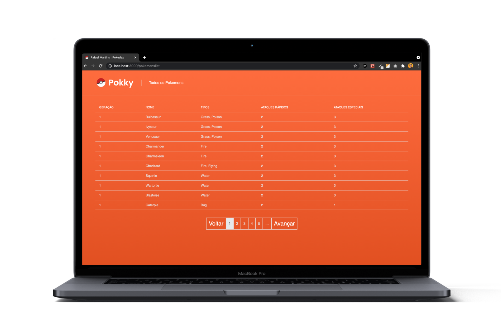

<h1 align="center">
    
    <br>
</h1>

<p align="center">
  <a href="https://www.linkedin.com/in/rafael-martins92/">
  
	</a>
  
  
  
  
  
  
  
  
</p>

<h4 align="center">
  <p>Pokky: The best Pokedex</p>
  
  <p>This application was developed to resolve a test problem.</p>

  <p>
  The test consists in create a full application (back-end and front-end) to show the pokemons from api. The application needs to have a page to create new pokemons, a login page and a registration page. 

  This application is being devoloped with Node.js and React JS.
  </p>
</h4>


<p align="center">
  <a href="#rocket-technologies">Technologies</a>&nbsp;&nbsp;&nbsp;|&nbsp;&nbsp;&nbsp;
  <a href="#information_source-how-to-use">How To Use</a>&nbsp;&nbsp;&nbsp;|&nbsp;&nbsp;&nbsp;
  <a href="#memo-license">License</a>
</p>

<p align="center">
  
  
</p>

## :rocket: Technologies

This project was developed with the following technologies:

-  [JavaScript](https://developer.mozilla.org/pt-BR/docs/Web/JavaScript)
-  [React JS](https://pt-br.reactjs.org/)
-  [Styled-Components](https://styled-components.com/)
-  [Node.js](https://nodejs.org/en/)
-  [VS Code][vc] with [EditorConfig][vceditconfig] and [ESLint][vceslint]

## :information_source: How to use

To clone and run this application, you'll need [Git](https://git-scm.com) installed on your computer. From your command line:

```bash
# Clone this repository
$ git clone https://github.com/rafaelmartins92/pokedex.git

# Go into the repository
$ cd pokedex

# Go into the client folder
$ cd client

# Install dependencies
$ npm install

# Run the application
$ npm start

# You can now view client in the browser
# On local: http://localhost:3000
```

## :memo: License
This project is under the MIT license. See the [LICENSE](https://github.com/rafaelmartins92/pokedex/blob/master/LICENSE) for more information.

---

<h4 align="center">
    Made with ♥ by Rafael Martins 👋 <a href="https://www.linkedin.com/in/rafael-martins92/" target="_blank">Get in touch!</a>
</h4>

[vc]: https://code.visualstudio.com/
[vceditconfig]: https://marketplace.visualstudio.com/items?itemName=EditorConfig.EditorConfig
[vceslint]: https://marketplace.visualstudio.com/items?itemName=dbaeumer.vscode-eslint
[demo]: https://pokedex-rafaelmartins.netlify.app/
